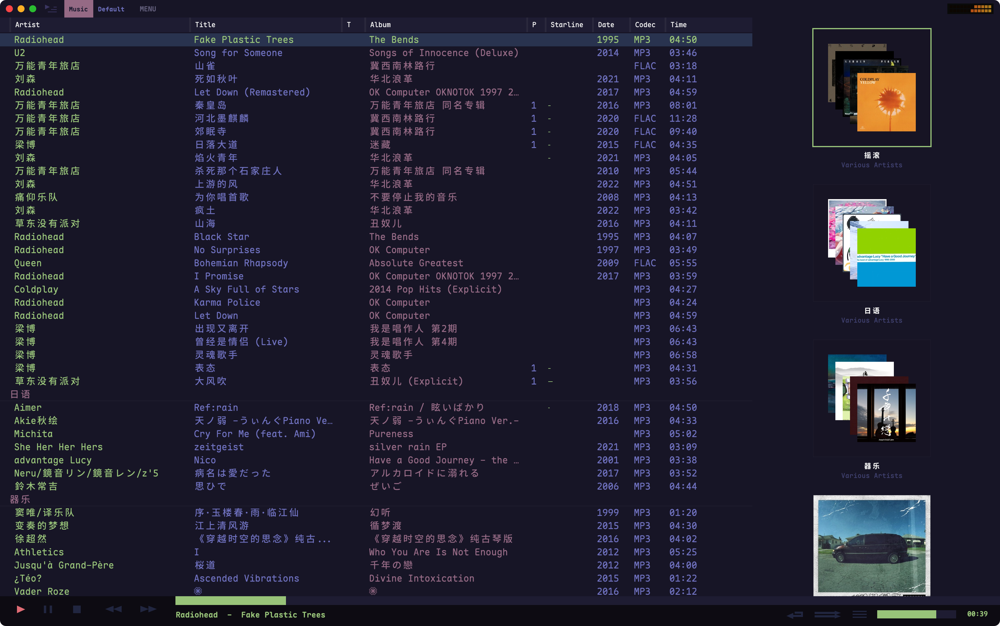
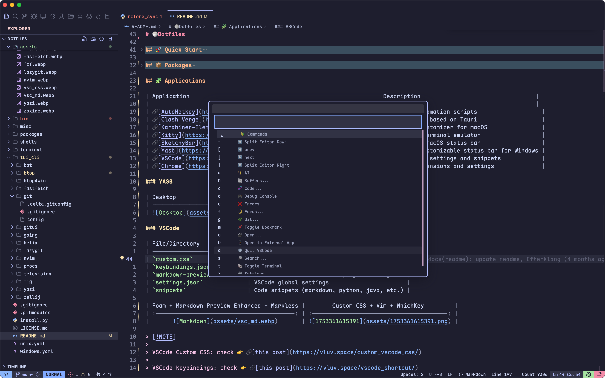
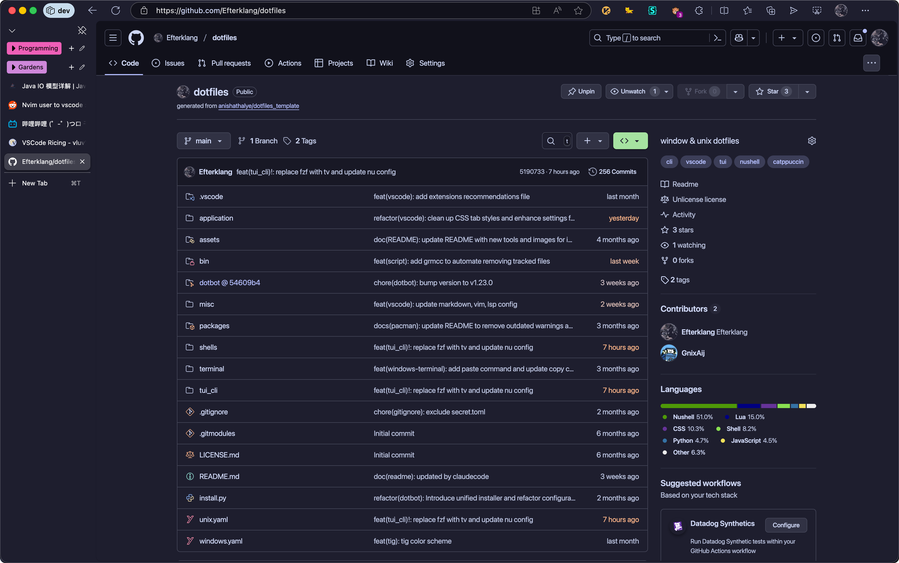
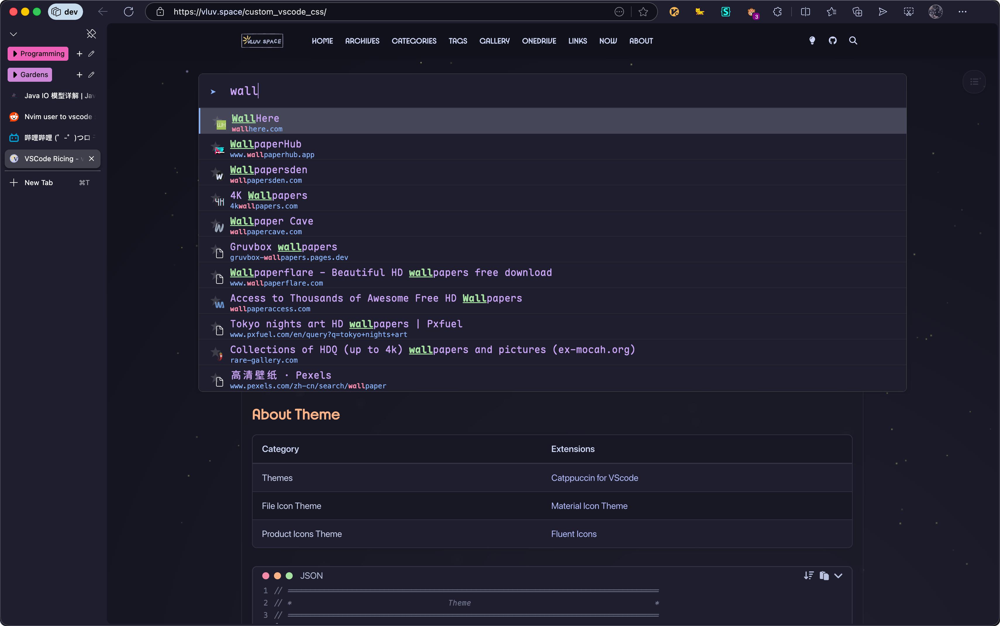

# 🍚Dotfiles

## 🚀 Quick Start

1. Run `./bin/sys_envs`, use XDG-Base Directory Specification (Optional)
2. Install packages [[packages/README]]
3. Run `install.py` to set up your environment.

> [!danger]
>
> back up the folder before installation, or run the `dotbot --dry-run` command to confirm the changes that will be applied.

## 💻 Terminal

Preferred terminals:

- **Windows Terminal**: For Windows systems
- **Wezterm**: Cross-platform terminal emulator

### Command Completions

- [Carapace](https://carapace.sh/): A multi-shell completion library and binary.
- [Inshellisense](https://github.com/microsoft/inshellisense): IDE style command line auto complete

> [!NOTE]
>
> Install
>
> - Windows: `scoop install extras/carapace-bin`
> - Linux:
>   - Arch: `yay -S carapace-bin`
>   - Others: check [carapace-sh.github.io/carapace-bin/install.html](https://carapace-sh.github.io/carapace-bin/install.html)
>
> Set Up Tutorial 👉 [NuShell命令补全 —— Carapace e.g](https://vluv.space/Tools/Terminal/nu_completion/)

### CLI ToolSet

| Tools                                                   | Description                                                                                  |
| ------------------------------------------------------- | -------------------------------------------------------------------------------------------- |
| [fd](https://github.com/sharkdp/fd)                     | A simple, fast and user-friendly alternative to 'find'                                       |
| [fzf](https://github.com/junegunn/fzf)                  | 🌸 A command-line fuzzy finder                                                                |
| [bat](https://github.com/sharkdp/bat)                   | A `cat(1)` clone with wings.                                                                 |
| [zoxide](https://github.com/ajeetdsouza/zoxide)         | A smarter cd command. Supports all major shells.                                             |
| [delta](https://dandavison.github.io/delta/)            | A syntax-highlighting pager for git, diff, and grep output                                   |
| [tailspin](https://github.com/bensadeh/tailspin)        | 🌀 A log file highlighter                                                                     |
| [fastfetch](https://github.com/fastfetch-cli/fastfetch) | A maintained, feature-rich and performance oriented, neofetch like system information tool.  |
| [ripgrep](https://github.com/BurntSushi/ripgrep)        | ripgrep recursively searches directories for a regex pattern while respecting your gitignore |

|              FastFetch              |           Bat           |
| :---------------------------------: | :---------------------: |
|  |  |

|           Fzf           |            Zoxide             |
| :---------------------: | :---------------------------: |
|  |  |

|            Delta            |              Television               |
| :-------------------------: | :-----------------------------------: |
|  |  |

> [!note] bat
>
> run this command to apply theme: `bat cache --build`

### TUI ToolSet

| Tool                                                   | Description                                                               |
| ------------------------------------------------------ | ------------------------------------------------------------------------- |
| [helix](https://github.com/helix-editor/helix)         | A post-modern modal text editor.                                          |
| [lazygit](https://github.com/jesseduffield/lazygit)    | simple terminal UI for git commands                                       |
| [yazi](https://github.com/sxyazi/yazi)                 | 💥 Blazing fast terminal file manager written in Rust, based on async I/O. |
| [zellij](https://github.com/zellij-org/zellij)         | A terminal workspace with batteries included                              |
| [lazyvim](https://github.com/LazyVim/LazyVim)          | Neovim config for the lazy                                                |
| [gping](https://github.com/orf/gping)                  | Ping, but with a graph                                                    |
| [btop4win](https://github.com/aristocratos/btop4win)   | btop++ for windows                                                        |
| [gitui](https://github.com/extrawurst/gitui)           | Blazing fast terminal-ui for git written in rust.                         |
| [procs](https://github.com/dalance/procs)              | A modern replacement for ps written in Rust.                              |
| [television](https://github.com/alexhallam/television) | A TUI for viewing images in the terminal.                                 |
| [tig](https://github.com/jonas/tig)                    | Text-mode interface for git.                                              |

|           LazyVim            |             LazyGit             |
| :--------------------------: | :-----------------------------: |
|  |  |

|           Yazi            |           btop            |
| :-----------------------: | :-----------------------: |
|  |  |

## 🐚 Shell

- Shell Prompt Theme
  - [oh-my-posh](https://ohmyposh.dev): A prompt theme engine for any shell.
- Shells
  - Nushell
  - Fish
  - Powershell7
  - Zsh

### Nushell

Features:

- Cross-platform support (Windows, macOS, Ubuntu)
- Vi editing mode by default
- Comprehensive completions (Scoop, VSCode, Winget, Zellij, UV)
- Custom aliases and keybindings
- Catppuccin and Tokyo Night themes

Check `./shells/nushell` for more information

### Oh My Posh

Installation

- Windows: `winget install JanDeDobbeleer.OhMyPosh -s winget`
- Linux: `curl -s https://ohmyposh.dev/install.sh | bash -s`

Configuration

```shell
oh-my-posh init fish --config ~/.config/ohmyposh/omp.json | source
```

```shell
oh-my-posh init bash --config ~/.config/ohmyposh/omp.json | source
```

## 🧩 Applications

| Application                                                       | Description                                  |
| ----------------------------------------------------------------- | -------------------------------------------- |
| [AutoHotkey](https://www.autohotkey.com/)                         | Windows automation scripts                   |
| [Clash Verge](https://github.com/clash-verge-rev/clash-verge-rev) | A Clash GUI based on Tauri                   |
| [Karabiner-Elements](https://karabiner-elements.pqrs.org/)        | Keyboard customizer for macOS                |
| [Kitty](https://sw.kovidgoyal.net/kitty/)                         | GPU-based terminal emulator                  |
| [SketchyBar](https://github.com/FelixKratz/SketchyBar)            | A flexible macOS status bar                  |
| [Yasb](https://github.com/denBot/yasb)                            | A highly customizable status bar for Windows |
| [VSCode](https://code.visualstudio.com/)                          | Code editor settings and snippets            |
| [Chrome](https://www.google.com/chrome/)                          | Browser extensions and settings              |

### Tauno

|       Music List And Gallery       |
| :--------------------------------: |
|  |

### YASB

| Desktop                         |
| ------------------------------- |
|  |

### VSCode

| File/Directory              | Description                                  |
| --------------------------- | -------------------------------------------- |
| `custom.css`                | Custom CSS styling for VSCode                |
| `keybindings.json`          | Keyboard shortcuts configuration             |
| `markdown-preview-enhanced` | Enhanced markdown preview plugin settings    |
| `settings.json`             | VSCode global settings                       |
| `snippets`                  | Code snippets (markdown, python, java, etc.) |

| Foam + Markdown Preview Enhanced + Markless |      Custom CSS + Vim + WhichKey       |
| :-----------------------------------------: | :------------------------------------: |
|              |  |

> [!NOTE]
>
> VSCode Custom CSS: check 👉 [this post](https://vluv.space/custom_vscode_css/)
>
> VSCode keybindings: check 👉 [this post](https://vluv.space/vscode_shortcut/)
>
> VSCode Extensions: check 👉 [this post](https://vluv.space/recommended_extensions/)

### Edge/Chrome

Extension List

- [**Stylus**](https://add0n.com/stylus.html)
  - User styles manager for customizing website appearance
- [**Vimium C**](https://github.com/gdh1995/vimium-c)
  - Keyboard-based navigation and tab operations
  - Features advanced omnibar functionality

|               Stylus                |               Vimium C                |
| :---------------------------------: | :-----------------------------------: |
|  |  |

## 📦 Packages

| File/Directory | Description               |
| -------------- | ------------------------- |
| `apt-get`      | Debian-based package list |
| `cargo`        | Rust package list         |
| `pacman`       | Arch Linux package list   |
| `scoop`        | Windows package list      |
