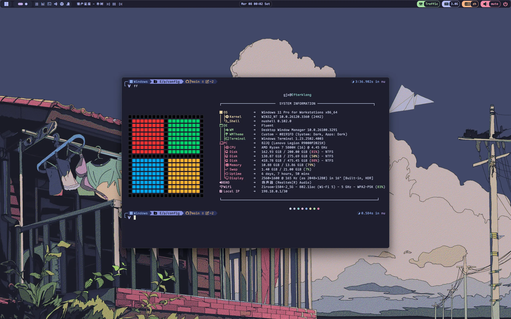
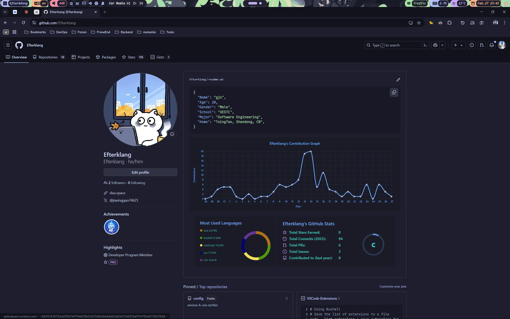
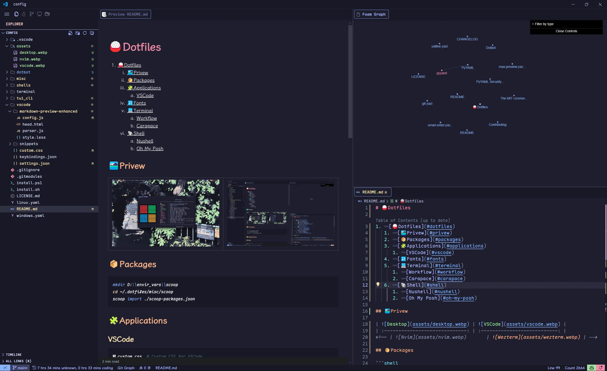

# 🍚Dotfiles

1. [🍚Dotfiles](#dotfiles)
   1. [✨Preview](#preview)
   2. [📦Packages](#packages)
   3. [🧩Applications](#applications)
      1. [VSCode](#vscode)
      2. [Chrome](#chrome)
   4. [🔣Fonts](#fonts)
   5. [💻Terminal](#terminal)
      1. [Workflow](#workflow)
         1. [Completion Tools](#completion-tools)
         2. [CLI](#cli)
         3. [TUI](#tui)
   6. [🐚Shell](#shell)
      1. [Nushell](#nushell)
      2. [Oh My Posh](#oh-my-posh)

## ✨Preview

|  |  |
| :-----------------------------: | :-----------------------------: |
|    |        |
|  |        |

## 📦Packages

Quick setup with Scoop package manager:

```bash
# Create Scoop environment directory
mkdir D:\\envir_vars\\scoop  # replace with your own directory

# Import package configuration
cd ~/.dotfiles/misc/scoop
scoop import ./scoop-packages.json
```

## 🧩Applications

### VSCode

| File/Directory              | Description                                  |
| --------------------------- | -------------------------------------------- |
| `custom.css`                | Custom CSS styling for VSCode                |
| `keybindings.json`          | Keyboard shortcuts configuration             |
| `markdown-preview-enhanced` | Enhanced markdown preview plugin settings    |
| `settings.json`             | VSCode global settings                       |
| `snippets`                  | Code snippets (markdown, python, java, etc.) |

### Chrome

Extension List

- [**Stylus**](https://add0n.com/stylus.html)
  - User styles manager for customizing website appearance
- [**Vimium C**](https://github.com/gdh1995/vimium-c)
  - Keyboard-based navigation and tab operations
  - Features advanced omnibar functionality

## 🔣Fonts

- LXGW WenKai
- Maple Mono NF CN
- Maple Hand
- Jetbrains Mono
- Monaspace

## 💻Terminal

Preferred terminals:

- **Windows Terminal**: For Windows systems
- **Wezterm**: Cross-platform terminal emulator

### Workflow

#### Completion Tools

- [Carapace](https://carapace.sh/): A multi-shell completion library and binary.
- [Inshellisense](https://github.com/microsoft/inshellisense): IDE style command line auto complete

> [!NOTE]
>
> Install
>
> - Windows: `scoop install extras/carapace-bin`
> - Linux:
>   - Arch: `yay -S carapace-bin`
>   - Others: check [carapace-sh.github.io/carapace-bin/install.html](https://carapace-sh.github.io/carapace-bin/install.html)
>
> Set Up Tutorial 👉 [NuShell命令补全 —— Carapace e.g](https://vluv.space/Tools/Terminal/nu_completion/)

#### CLI

| Tools                                            | Description                                                |
| ------------------------------------------------ | ---------------------------------------------------------- |
| [fd](https://github.com/sharkdp/fd)              | A simple, fast and user-friendly alternative to 'find'     |
| [fzf](https://github.com/junegunn/fzf)           | 🌸 A command-line fuzzy finder                              |
| [bat](https://github.com/sharkdp/bat)            | A `cat(1)` clone with wings.                               |
| [zoxide](https://github.com/ajeetdsouza/zoxide)  | A smarter cd command. Supports all major shells.           |
| [delta](https://dandavison.github.io/delta/)     | A syntax-highlighting pager for git, diff, and grep output |
| [tailspin](https://github.com/bensadeh/tailspin) | 🌀 A log file highlighter                                   |

#### TUI

| Tool                                                | Description                                                               |
| --------------------------------------------------- | ------------------------------------------------------------------------- |
| [helix](https://github.com/helix-editor/helix)      | A post-modern modal text editor.                                          |
| [lazygit](https://github.com/jesseduffield/lazygit) | simple terminal UI for git commands                                       |
| [yazi](https://github.com/sxyazi/yazi)              | 💥 Blazing fast terminal file manager written in Rust, based on async I/O. |

## 🐚Shell

- Shell Prompt Theme
  - [oh-my-posh](https://ohmyposh.dev): A prompt theme engine for any shell.
- Shells
  - Nushell
  - Fish
  - Powershell7

### Nushell

Check `./shells/nushell` for more infomation

### Oh My Posh

Installation

- Windows: `winget install JanDeDobbeleer.OhMyPosh -s winget`
- Linux: `curl -s https://ohmyposh.dev/install.sh | bash -s`

Configuration

```bash
# Nushell configuration
oh-my-posh init nu --config ~/.config/ohmyposh/omp.json --print | save ./shells/nushell/plugins/omp.nu --force

# Fish configuration
oh-my-posh init fish --config ~/.config/ohmyposh/omp.json | source

# Bash configuration
oh-my-posh init bash --config ~/.config/ohmyposh/omp.json | source
```
