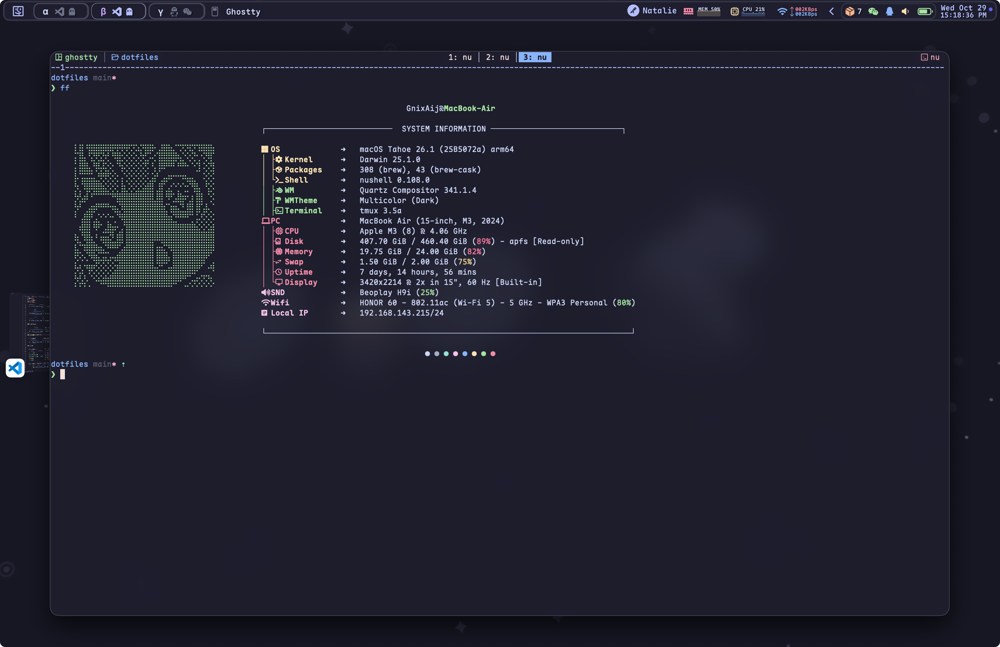
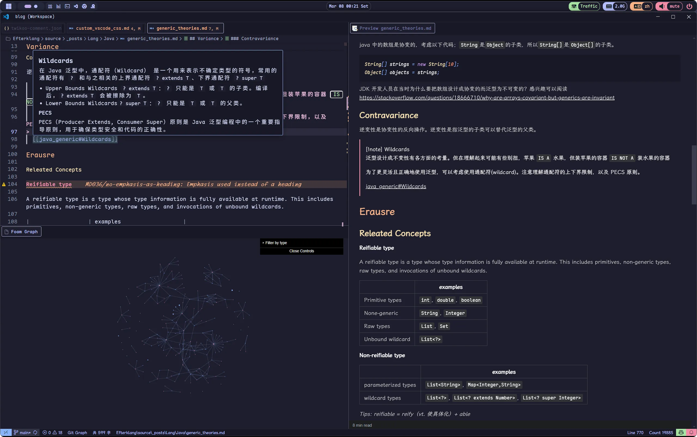

# 🍚Dotfiles

## 🚀 Quick Start

1. Run `./bin/envs`, this will set-up `XDG_` and other environment variables.
2. [Install packages](https://github.com/Efterklang/dotfiles/tree/main/packages)
3. Run `install.py` to set up your environment.

> [!WARNING]
>
> back up the folder before installation, or run the `dotbot --dry-run` command to confirm the changes that will be applied.

## 💻 Terminal

Preferred terminals:

- **Ghostty**: A fast, feature-rich, and cross-platform terminal emulator that uses platform-native UI and GPU acceleration.
- **Kitty**: A fast, feature-rich, and highly customizable terminal emulator
- **WezTerm**: Cross-platform terminal emulator
- **Windows Terminal**: For Windows systems

Terminal Multiplexer(zellij & tmux):

|            Zellij             |           Tmux            |
| :---------------------------: | :-----------------------: |
|  |  |

### CLI & TUI Tool Set

| Tools                                                   | Description                                                                                  |
| ------------------------------------------------------- | -------------------------------------------------------------------------------------------- |
| [bat](https://github.com/sharkdp/bat)                   | A `cat(1)` clone with wings.                                                                 |
| [delta](https://dandavison.github.io/delta/)            | A syntax-highlighting pager for git, diff, and grep output                                   |
| [eza](https://github.com/eza-community/eza)             | A modern replacement for `ls`.                                                               |
| [fastfetch](https://github.com/fastfetch-cli/fastfetch) | A maintained, feature-rich and performance oriented, neofetch like system information tool.  |
| [fd](https://github.com/sharkdp/fd)                     | A simple, fast and user-friendly alternative to 'find'                                       |
| [lla](https://github.com/chaqchase/lla)                 | blazing fast `ls` replacement with superpowers                                               |
| [ripgrep](https://github.com/BurntSushi/ripgrep)        | ripgrep recursively searches directories for a regex pattern while respecting your gitignore |
| [tailspin](https://github.com/bensadeh/tailspin)        | 🌀 A log file highlighter                                                                    |
| [zoxide](https://github.com/ajeetdsouza/zoxide)         | A smarter cd command. Supports all major shells.                                             |

---

fuzzy finders:

|           Fzf           |              Television               |
| :---------------------: | :-----------------------------------: |
|  |  |

diff & cd replacement:

|            Delta            |            Zoxide             |
| :-------------------------: | :---------------------------: |
|  |  |

ls & cat replacement:

|          eza & lla          |           Bat           |
| :-------------------------: | :---------------------: |
|  |  |

---

| Tool                                                   | Description                                                                |
| ------------------------------------------------------ | -------------------------------------------------------------------------- |
| [btop4win](https://github.com/aristocratos/btop4win)   | btop++ for windows                                                         |
| [fzf](https://github.com/junegunn/fzf)                 | 🌸 A command-line fuzzy finder                                             |
| [gitui](https://github.com/extrawurst/gitui)           | Blazing fast terminal-ui for git written in rust.                          |
| [gping](https://github.com/orf/gping)                  | Ping, but with a graph                                                     |
| [helix](https://github.com/helix-editor/helix)         | A post-modern modal text editor.                                           |
| [lazygit](https://github.com/jesseduffield/lazygit)    | simple terminal UI for git commands                                        |
| [lazyvim](https://github.com/LazyVim/LazyVim)          | Neovim config for the lazy                                                 |
| [procs](https://github.com/dalance/procs)              | A modern replacement for ps written in Rust.                               |
| [scooter](https://github.com/thomasschafer/scooter)    | Interactive find-and-replace in the terminal Resources                     |
| [television](https://github.com/alexhallam/television) | A cross-platform, fast and extensible general purpose fuzzy finder 📺      |
| [tig](https://github.com/jonas/tig)                    | Text-mode interface for git.                                               |
| [yazi](https://github.com/sxyazi/yazi)                 | 💥 Blazing fast terminal file manager written in Rust, based on async I/O. |

|           LazyVim            |             LazyGit             |
| :--------------------------: | :-----------------------------: |
|  |  |

|           btop            |            Procs            |
| :-----------------------: | :-------------------------: |
|  |  |

|           Yazi            |             Scooter             |
| :-----------------------: | :-----------------------------: |
|  |  |

## 🐚 Shell

- Prompt Theme
  - [oh-my-posh](https://ohmyposh.dev): A prompt theme engine for any shell.
  - [starship](https://starship.rs): The minimal, blazing-fast, and infinitely customizable prompt for any shell.
- Completion:
  - [Carapace](https://carapace.sh/): A multi-shell completion library and binary.
  - [Inshellisense](https://github.com/microsoft/inshellisense): IDE style command line auto complete
- Shells
  - Fish
  - Nushell
  - Powershell 7
  - Zsh

## 🧩 Applications

| Application                                                       | Description                                  |
| ----------------------------------------------------------------- | -------------------------------------------- |
| [AutoHotkey](https://www.autohotkey.com/)                         | Windows automation scripts                   |
| [Chrome](https://www.google.com/chrome/)                          | Browser extensions and settings              |
| [Clash Verge](https://github.com/clash-verge-rev/clash-verge-rev) | A Clash GUI based on Tauri                   |
| [Karabiner-Elements](https://karabiner-elements.pqrs.org/)        | Keyboard customizer for macOS                |
| [Kitty](https://sw.kovidgoyal.net/kitty/)                         | GPU-based terminal emulator                  |
| [SketchyBar](https://github.com/FelixKratz/SketchyBar)            | A flexible macOS status bar                  |
| [VSCode](https://code.visualstudio.com/)                          | Code editor settings and snippets            |
| [Yasb](https://github.com/denBot/yasb)                            | A highly customizable status bar for Windows |

### Music Player

|            Tauon            | mpd + rmpc               |
| :-------------------------: | ------------------------ |
|  |  |

### StatusBar & FastFetch

| Yasb(Windows)             | SketchyBar(Mac)                       |
| ------------------------- | ------------------------------------- |
|  |  |

### VSCode

| File/Directory              | Description                                  |
| --------------------------- | -------------------------------------------- |
| `custom.css`                | Custom CSS styling for VSCode                |
| `keybindings.json`          | Keyboard shortcuts configuration             |
| `markdown-preview-enhanced` | Enhanced markdown preview plugin settings    |
| `settings.json`             | VSCode global settings                       |
| `snippets`                  | Code snippets (markdown, python, java, etc.) |

| Foam + Markdown Preview Enhanced + Markless |    Custom CSS + Vim + WhichKey     |
| :-----------------------------------------: | :--------------------------------: |
|              |  |

> [!NOTE]
>
> VSCode Custom CSS: check 👉 [this post](https://vluv.space/custom_vscode_css/)
>
> VSCode keybindings: check 👉 [this post](https://vluv.space/vscode_shortcut/)
>
> VSCode Extensions: check 👉 [this post](https://vluv.space/recommended_extensions/)

### Browser

Extension List

- [**Stylus**](https://add0n.com/stylus.html)
  - User styles manager for customizing website appearance
- [**Vimium C**](https://github.com/gdh1995/vimium-c)
  - Keyboard-based navigation and tab operations
  - Features advanced omnibar functionality

|                Stylus                |             Vimium C              |
| :----------------------------------: | :-------------------------------: |
|  |  |
