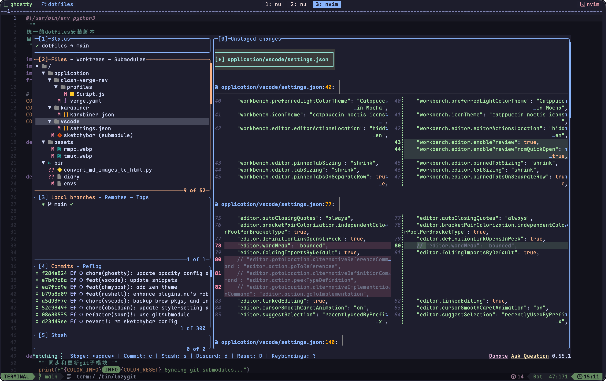
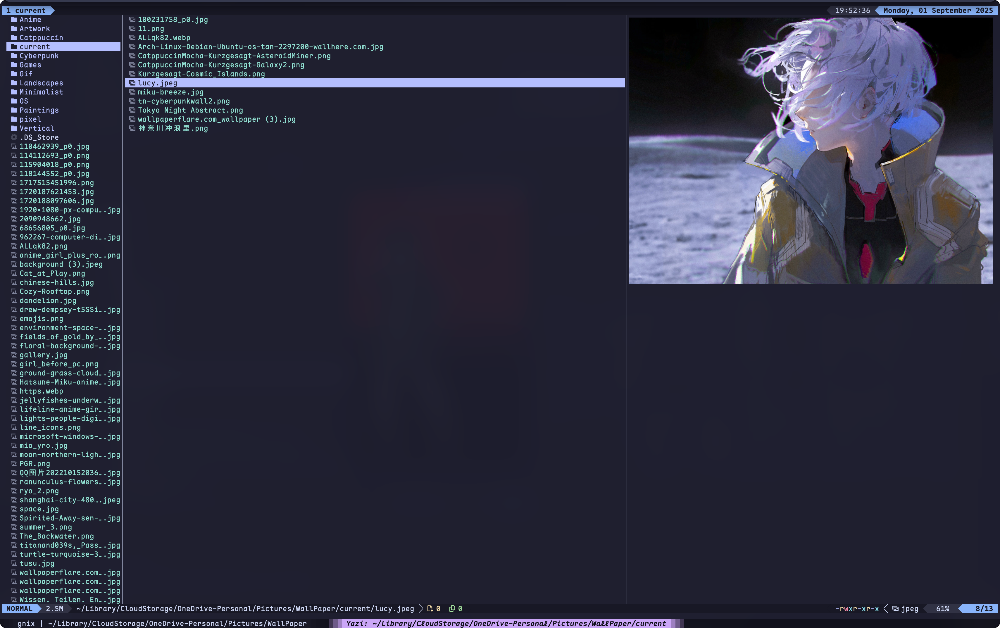

# 🍚Dotfiles

## 📋目录

1. [🍚Dotfiles](#dotfiles)
   1. [📋目录](#目录)
   2. [🚀 Quick Start](#-quick-start)
   3. [📦Packages](#packages)
   4. [🧩Applications](#applications)
      1. [VSCode](#vscode)
      2. [Chrome](#chrome)
   5. [🔣Fonts](#fonts)
   6. [💻Terminal](#terminal)
      1. [Workflow](#workflow)
         1. [Completion Tools](#completion-tools)
         2. [CLI](#cli)
         3. [TUI](#tui)
   7. [🐚Shell](#shell)
      1. [Nushell](#nushell)
      2. [Oh My Posh](#oh-my-posh)

| Desktop                         |
| ------------------------------- |
|  |

## 🚀 Quick Start

Use the unified Python installation script, which automatically detects the operating system and performs the corresponding installation:

```shell
chmod +x ./install.py
./install.py
```

## 📦Packages

| File/Directory | Description               |
| -------------- | ------------------------- |
| `apt-get`      | Debian-based package list |
| `cargo`        | Rust package list         |
| `scoop`        | Windows package list      |

## 🛠️ Custom Scripts

| Script | Description |
| ------ | ----------- |
| `bin/gline` | Git repository statistics tool with colorful output |
| `bin/mocha_it` | Convert image to catppuccin color scheme with webp format |
| `bin/reload_xdg` | XDG desktop environment reload utility |

## 🧩Applications

|            VSCode             |             Chrome              |
| :---------------------------: | :-----------------------------: |
|  |  |

### VSCode

| File/Directory              | Description                                  |
| --------------------------- | -------------------------------------------- |
| `custom.css`                | Custom CSS styling for VSCode                |
| `keybindings.json`          | Keyboard shortcuts configuration             |
| `markdown-preview-enhanced` | Enhanced markdown preview plugin settings    |
| `settings.json`             | VSCode global settings                       |
| `snippets`                  | Code snippets (markdown, python, java, etc.) |

| Foam + Markdown Preview Enhanced + Markless |       Custom CSS for VSCode        |
| :-----------------------------------------: | :--------------------------------: |
|              |  |

> [!NOTE]
>
> VSCode Custom CSS: check 👉 [this post](https://vluv.space/Tools/VSCode/custom_vscode_css/)
>
> VSCode keybindings: check 👉 [this post](https://vluv.space/Tools/VSCode/vscode_shortcut/)
>
> VSCode Extensions: check 👉 [this post](https://vluv.space/Tools/VSCode/recommended_extensions/)

### Chrome

Extension List

- [**Stylus**](https://add0n.com/stylus.html)
  - User styles manager for customizing website appearance
- [**Vimium C**](https://github.com/gdh1995/vimium-c)
  - Keyboard-based navigation and tab operations
  - Features advanced omnibar functionality

## 🔣Fonts

- LXGW WenKai
- Maple Mono NF CN
- Maple Hand
- Jetbrains Mono
- Monaspace

## 💻Terminal

Preferred terminals:

- **Windows Terminal**: For Windows systems
- **Wezterm**: Cross-platform terminal emulator

### Workflow

#### Completion Tools

- [Carapace](https://carapace.sh/): A multi-shell completion library and binary.
- [Inshellisense](https://github.com/microsoft/inshellisense): IDE style command line auto complete

> [!NOTE]
>
> Install
>
> - Windows: `scoop install extras/carapace-bin`
> - Linux:
>   - Arch: `yay -S carapace-bin`
>   - Others: check [carapace-sh.github.io/carapace-bin/install.html](https://carapace-sh.github.io/carapace-bin/install.html)
>
> Set Up Tutorial 👉 [NuShell命令补全 —— Carapace e.g](https://vluv.space/Tools/Terminal/nu_completion/)

#### CLI

| Tools                                                   | Description                                                                                  |
| ------------------------------------------------------- | -------------------------------------------------------------------------------------------- |
| [fd](https://github.com/sharkdp/fd)                     | A simple, fast and user-friendly alternative to 'find'                                       |
| [fzf](https://github.com/junegunn/fzf)                  | 🌸 A command-line fuzzy finder                                                                |
| [bat](https://github.com/sharkdp/bat)                   | A `cat(1)` clone with wings.                                                                 |
| [zoxide](https://github.com/ajeetdsouza/zoxide)         | A smarter cd command. Supports all major shells.                                             |
| [delta](https://dandavison.github.io/delta/)            | A syntax-highlighting pager for git, diff, and grep output                                   |
| [tailspin](https://github.com/bensadeh/tailspin)        | 🌀 A log file highlighter                                                                     |
| [fastfetch](https://github.com/fastfetch-cli/fastfetch) | A maintained, feature-rich and performance oriented, neofetch like system information tool.  |
| [ripgrep](https://github.com/BurntSushi/ripgrep)        | ripgrep recursively searches directories for a regex pattern while respecting your gitignore |

|              FastFetch              |           Bat           |
| :---------------------------------: | :---------------------: |
|  |  |

|           Fzf           |            Zoxide             |
| :---------------------: | :---------------------------: |
|  |  |

> [!note] bat
>
> run this command to apply theme: `bat cache --build`

#### TUI

| Tool                                                 | Description                                                               |
| ---------------------------------------------------- | ------------------------------------------------------------------------- |
| [helix](https://github.com/helix-editor/helix)       | A post-modern modal text editor.                                          |
| [lazygit](https://github.com/jesseduffield/lazygit)  | simple terminal UI for git commands                                       |
| [yazi](https://github.com/sxyazi/yazi)               | 💥 Blazing fast terminal file manager written in Rust, based on async I/O. |
| [zellij](https://github.com/zellij-org/zellij)       | A terminal workspace with batteries included                               |
| [lazyvim](https://github.com/LazyVim/LazyVim)        | Neovim config for the lazy                                                |
| [gping](https://github.com/orf/gping)                | Ping, but with a graph                                                    |
| [btop4win](https://github.com/aristocratos/btop4win) | btop++ for windows                                                        |

|           LazyVim            |             LazyGit             |
| :--------------------------: | :-----------------------------: |
|  |  |

|           Yazi            |         btop4win          |
| :-----------------------: | :-----------------------: |
|  |  |

## 🐚Shell

- Shell Prompt Theme
  - [oh-my-posh](https://ohmyposh.dev): A prompt theme engine for any shell.
- Shells
  - Nushell
  - Fish
  - Powershell7

### Nushell

Features:
- Cross-platform support (Windows, macOS, Ubuntu)
- Fuzzy folder navigation support
- Vi editing mode by default
- Comprehensive completions (Scoop, VSCode, Winget, Zellij, UV)
- Custom aliases and keybindings
- Catppuccin and Tokyo Night themes

Check `./shells/nushell` for more information

### Oh My Posh

Installation

- Windows: `winget install JanDeDobbeleer.OhMyPosh -s winget`
- Linux: `curl -s https://ohmyposh.dev/install.sh | bash -s`

Configuration

```shell
oh-my-posh init fish --config ~/.config/ohmyposh/omp.json | source
```

```shell
oh-my-posh init bash --config ~/.config/ohmyposh/omp.json | source
```
