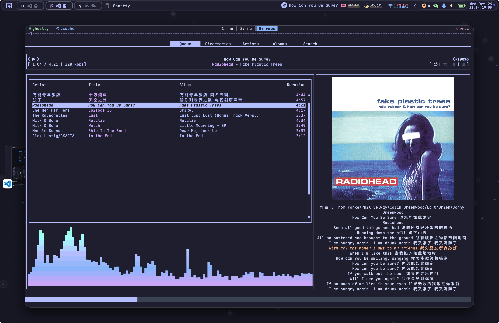
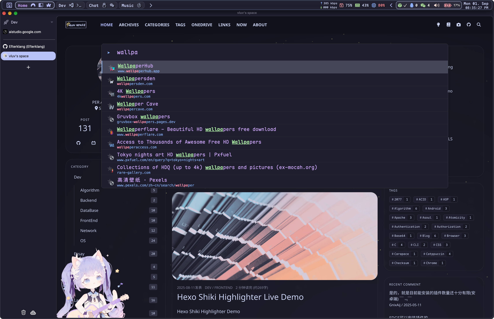

<h1 align="center">
  
   
  Dotfiles
   
  
  
</h1>

  Personal development environment configurations for Windows, macOS, and Linux

---

## Table of Contents

- [Installation](#installation)
- [VSCode](#vscode)
- [Music Player](#music-player)
- [Status Bar](#status-bar)
- [Browser](#browser)
- [Terminal](#terminal)
  - [Shell](#shell)
  - [Terminal Multiplexer](#terminal-multiplexer)
  - [Fuzzy Finders](#fuzzy-finders)
  - [TUI/CLI Tools](#tuicli-tools)

---

## Installation

For detailed installation instructions, please refer to [docs/INSTALL.md](docs/INSTALL.md).

---

## VSCode

| Setting | Value |
|---------|-------|
| Theme | Catppuccin Mocha |
| Icon | Catppuccin Noctis Icons |

| File/Directory | Description |
|----------------|-------------|
| `custom.css` | Custom CSS styling for VSCode |
| `keybindings.json` | Keyboard shortcuts configuration |
| `settings.json` | VSCode global settings |
| `snippets/` | Code snippets (markdown, python, java, etc.) |

---

## Music Player

| TauonMusicBox | mpd + rmpc + cava |
|:-------------:|:----------------:|
|  |  |

---

## Status Bar

| Platform | Application |
|----------|-------------|
| Windows | Yasb |
| macOS | SketchyBar |

| Yasb (Windows) | SketchyBar (macOS) |
|:--------------:|:------------------:|
|  |  |

> **Note:** For Windows, alternative options include GlazeWM and Zebar. For macOS configuration details, see [SketchyBar config](https://github.com/Efterklang/sketchybar).

---

## Browser

### Extensions

| Extension | Description |
|-----------|-------------|
| [Stylus](https://add0n.com/stylus.html) | User styles manager for customizing website appearance |
| [Vimium C](https://github.com/gdh1995/vimium-c) | Keyboard-based navigation and tab operations with advanced omnibar functionality |

| Stylus | Vimium C |
|:------:|:---------:|
|  |  |

---

## Terminal

### Shell

Nushell serves as the primary shell, providing a modern and powerful command-line experience with excellent aesthetics.

### Terminal Multiplexer

| Zellij | Tmux |
|:------:|:----:|
|  |  |

### Fuzzy Finders

| fzf | Television |
|:---:|:----------:|
|  |  |

### TUI/CLI Tools

#### Command Replacements

| Original Command | Replacement |
|-----------------|-------------|
| `diff` | delta |
| `cd` | zoxide |
| `ls` | eza, lla |
| `cat` | bat |
| `grep` | ripgrep |
| `vim` | nvim |
| `git` | lazygit |
| `top` | btop |
| `ps` | procs |
| `ranger` | yazi |

#### Tool Screenshots

| Delta | Zoxide |
|:-----:|:------:|
|  |  |

| eza & lla | bat |
|:---------:|:---:|
|  |  |

| NeoVim | LazyGit |
|:------:|:-------:|
|  |  |

| btop | Procs |
|:----:|:-----:|
|  |  |

| Yazi | Scooter |
|:----:|:-------:|
|  |  |

---

## License

This project is licensed under the MIT License.
