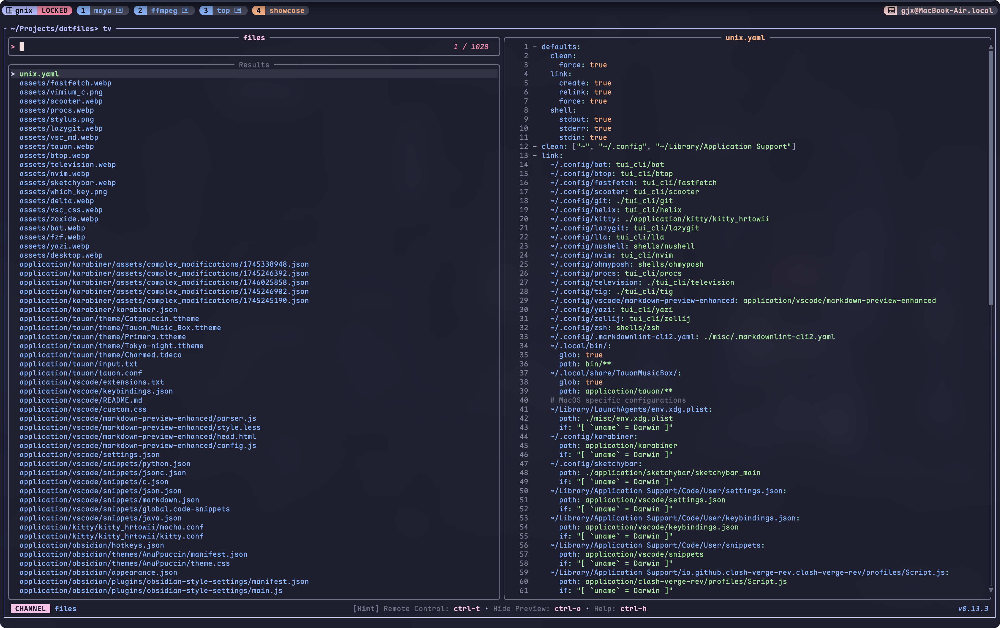

# 🍚Dotfiles

For installation instructions, refer to [docs/INSTALL.md](docs/INSTALL.md)

## Screenshots

### Terminal Multiplexer

|            Zellij             |           Tmux            |
| :---------------------------: | :-----------------------: |
|  |  |

### Fuzzy finders

|           Fzf           |              Television               |
| :---------------------: | :-----------------------------------: |
|  |  |

### diff & cd replacement

|            Delta            |            Zoxide             |
| :-------------------------: | :---------------------------: |
|  |  |

### ls & cat replacement

|          eza & lla          |           Bat           |
| :-------------------------: | :---------------------: |
|  |  |

### TUI Tools

|           LazyVim            |             LazyGit             |
| :--------------------------: | :-----------------------------: |
|  |  |

|           btop            |            Procs            |
| :-----------------------: | :-------------------------: |
|  |  |

|           Yazi            |             Scooter             |
| :-----------------------: | :-----------------------------: |
|  |  |

### Music Player

|            Tauon            | mpd + rmpc               |
| :-------------------------: | ------------------------ |
|  |  |

### StatusBar & FastFetch

| Yasb(Windows)             | SketchyBar(Mac)                       |
| ------------------------- | ------------------------------------- |
|  |  |

### VSCode

| File/Directory              | Description                                  |
| --------------------------- | -------------------------------------------- |
| `custom.css`                | Custom CSS styling for VSCode                |
| `keybindings.json`          | Keyboard shortcuts configuration             |
| `markdown-preview-enhanced` | Enhanced markdown preview plugin settings    |
| `settings.json`             | VSCode global settings                       |
| `snippets`                  | Code snippets (markdown, python, java, etc.) |

| Foam + Markdown Preview Enhanced + Markless |    Custom CSS + Vim + WhichKey     |
| :-----------------------------------------: | :--------------------------------: |
|              |  |

> [!NOTE]
>
> VSCode Custom CSS: check 👉 [this post](https://vluv.space/custom_vscode_css/)

### Browser

Extension List

- [**Stylus**](https://add0n.com/stylus.html)
  - User styles manager for customizing website appearance
- [**Vimium C**](https://github.com/gdh1995/vimium-c)
  - Keyboard-based navigation and tab operations
  - Features advanced omnibar functionality

|                Stylus                |             Vimium C              |
| :----------------------------------: | :-------------------------------: |
|  |  |
