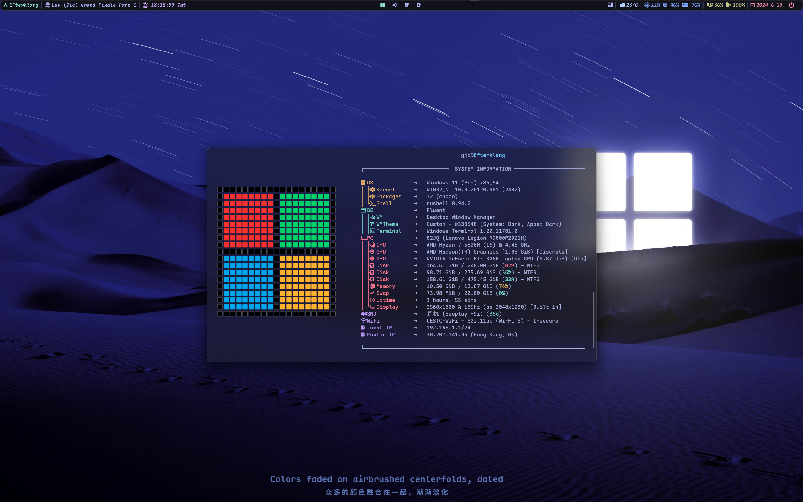

# Intro

## Structure

- `.glaze-wm`: A window manager for windows
- `TUI&CLI`: Terminal tools and shell config
- `Wezterm`: A cross-platform terminal emulator and multiplexer
- `LX-Muisc`: Music lists
- `MISC`: config for git,wsl;scoop app list...
- `FlowLauncher`

## Preview

- **Window Manager**: [GlazeWM](https://github.com/glzr-io/glazewm)
- **Terminal**: Windows Terminal & [Wezterm](https://github.com/wez/wezterm) + [OhMyPosh](https://github.com/JanDeDobbeleer/oh-my-posh) + Nushell
- **SysInfo**: Fastfetch

