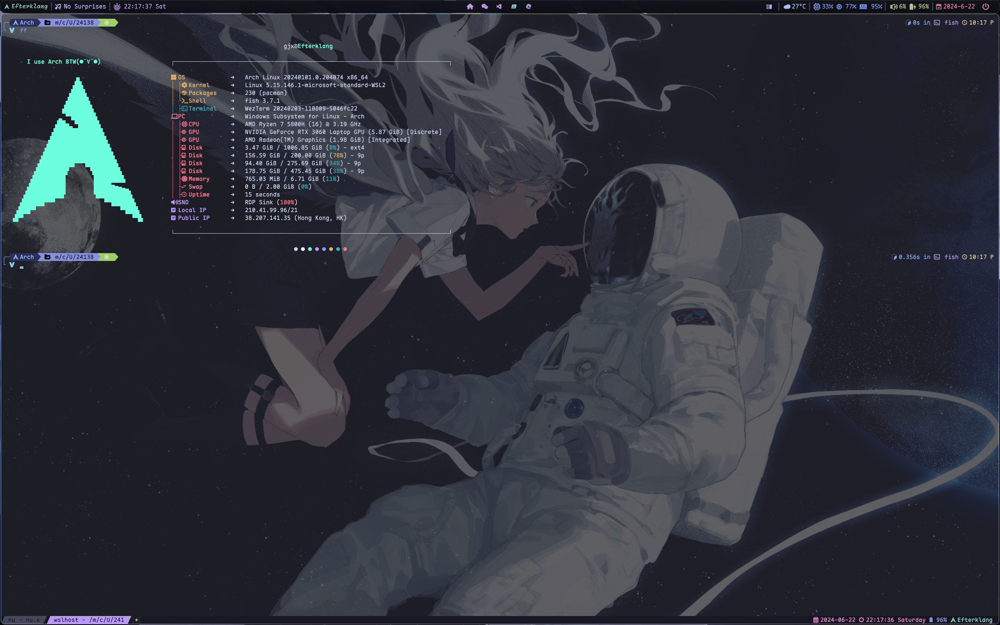

# Intro

**Structure**

- `.glaze-wm`: A window manager for windows
- `TUI&CLI`: Terminal tools and shell config
- `Wezterm`: A cross-platform terminal emulator and multiplexer
- `LX-Muisc`: Music lists
- `MISC`: config for git,wsl;scoop app list...

## Window Manager

- [GlazeWM](https://github.com/glzr-io/glazewm) GlazeWM is a tiling window manager for Windows inspired by i3 and Polybar.

- [Wezterm](https://github.com/wez/wezterm) A GPU-accelerated cross-platform terminal emulator and multiplexer written by @wez and implemented in Rust
- [OhMyPosh](https://github.com/JanDeDobbeleer/oh-my-posh) The most customisable and low-latency cross platform/shell prompt renderer

